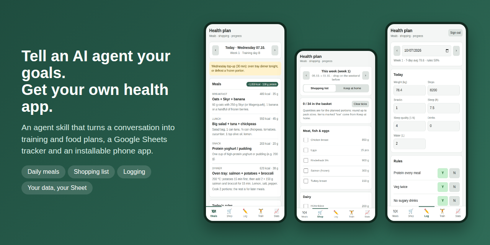
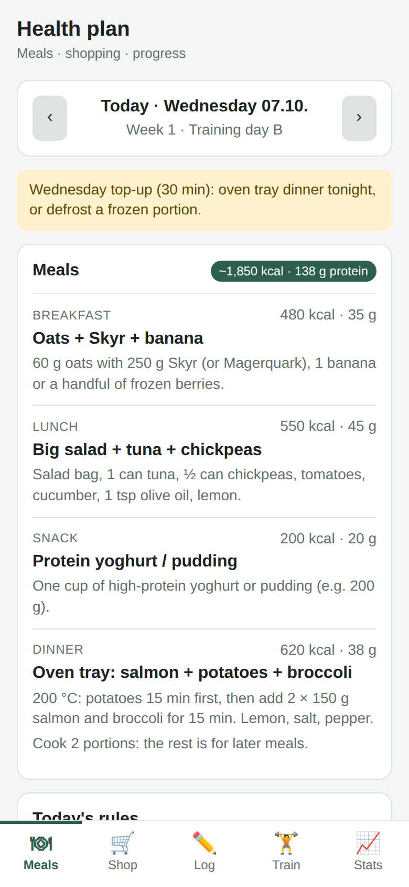
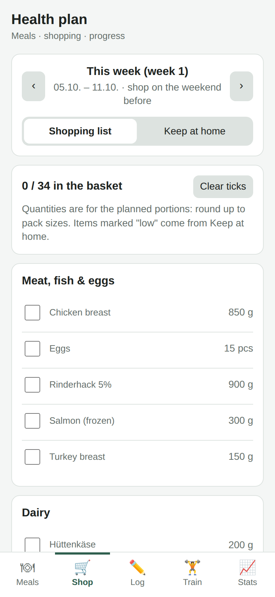
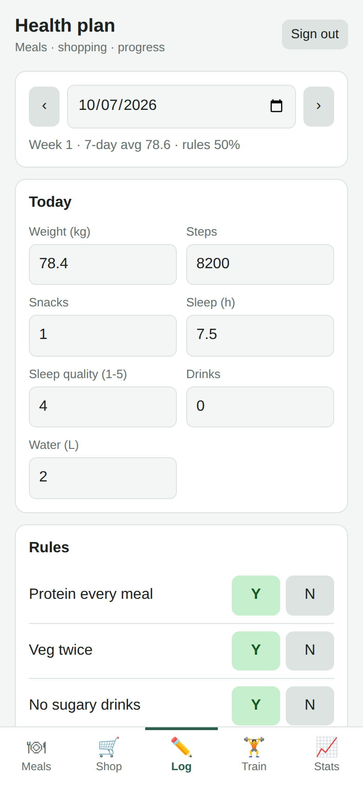

# Health plan app

**Tell an AI agent your health goals. Get your own plans, a tracker and an installable phone app.**



**[Try the demo](https://dineshvg.github.io/health-plan-app/)** (example plan, made-up person) · **[Download the skill](https://github.com/dineshvg/health-plan-app/raw/main/skill/health-plan-to-app.zip)**

A plan you can carry in your pocket: an installable phone app (PWA) that tells you **what to eat today**, builds **this week's shopping list**, keeps a **"keep at home"** pantry list, and lets you **log weight, habits, workouts and a Sunday review** straight into your own Google Sheet.

- No backend, no account with anyone: the app is static files on GitHub Pages, your data lives in your Google Sheet.
- Works offline for meals and shopping. Logging needs a connection and Google sign-in.
- Built to be generated by an AI agent from a conversation about your goals: see [`skill/SKILL.md`](skill/SKILL.md).

> Not medical advice. If you have a health condition, talk to your doctor before changing diet or training.

## Use it in 3 steps

1. **Add the skill** to Claude: download [`health-plan-to-app.zip`](https://github.com/dineshvg/health-plan-app/raw/main/skill/health-plan-to-app.zip) and upload it under Settings → Capabilities → Skills (or copy [`skill/SKILL.md`](skill/SKILL.md) into your agent's skills folder).
2. **Tell the agent your goals**: "Build me a health plan and app with this skill." It asks one round of questions (goal, food, equipment, schedule) and writes the plans, `plan.json` and the tracker.
3. **Open your app**: follow the agent's sign-in and GitHub Pages steps (about 20 minutes, described below), then install it on your phone.

| Meals | Shopping list | Log |
|---|---|---|
|  |  |  |

## What's inside

| Path | What |
|---|---|
| `app/` | The PWA: `index.html`, `app.js`, `sw.js`, `manifest.webmanifest`, icons |
| `app/plan.json` | **Your plan** (public): meals, a rotating set of weeks, rules, pantry, shopping categories. No personal data |
| `app/config.js` | Your Google OAuth client ID and sheet ID |
| `tracker/settings.example.json` | Tracker settings: weights, goal, milestones, habit, rules, sessions. Copy to `tracker/settings.json` (git-ignored) |
| `tracker/build_tracker.py` | Builds the 5-tab tracker (.xlsx) from your private settings |
| `tests/` | `validate_plan.py` (plan checks + privacy) and `smoke.js` (phone-size browser test with Google mocked); `npm test` runs both |
| `tracker/LAYOUT.md` | Which cells the app reads and writes |
| `skill/SKILL.md` | Agent skill: interview → plans → `plan.json` → sheet → deployed app. `skill/health-plan-to-app.zip` is the same file, ready to upload to Claude |
| `media/` | Screenshots and the social preview image (example data only) |

## Set it up (about 20 minutes)

1. **Copy the repo**: "Use this template" → new **public** repo (free GitHub Pages needs public).
2. **Write your plan** in `app/plan.json` (or let an agent do it with the skill). Schema below.
3. **Build the tracker**: copy `tracker/settings.example.json` into your **private** plans repo (or to `tracker/settings.json` here, which is git-ignored) and fill in your numbers. Keep exactly one copy. Then `pip install openpyxl && python3 tracker/build_tracker.py path/to/settings.json` → upload `tracker/tracker.xlsx` to Google Drive → open with Google Sheets → File → Save as Google Sheets. Share it (Editor) with every Google account that should log. Copy its ID from the URL into `SHEET_ID` in `app/config.js`.
4. **Google sign-in** (once):
   1. [console.cloud.google.com](https://console.cloud.google.com) → new project.
   2. APIs & Services → Library → enable **Google Sheets API**.
   3. OAuth consent screen: External, Testing; add your Google accounts as **test users**.
   4. Clients → Create client → **Web application**; Authorized JavaScript origin `https://<your-user>.github.io`.
   5. Put the Client ID in `CLIENT_ID` in `app/config.js`. The client ID is public by design; you never need the client secret.
5. **Publish**: repo Settings → Pages → Source: **GitHub Actions**. Push to `main`; the app appears at `https://<your-user>.github.io/<repo>/`.
6. **Install** on your phone: Android Chrome ⋮ → Install app; iPhone Safari Share → Add to Home Screen.

After changing anything in `app/`, run `npm install && npm test` (basic plan checks + phone-size browser test; set `CHROMIUM_PATH` to use an existing Chromium) and the full plan check `python3 tests/validate_plan.py --exclude <diet words> --private path/to/settings.json`, and bump `VERSION` in `app/sw.js` so phones pick up the new version.

## `plan.json` schema

```jsonc
{
  "name": "Health plan",                 // app title
  "startDate": "2026-10-05",             // a Monday; week 1 of the plan (the sheet's Dashboard!B2 wins once signed in)
  "target": { "kcal": 2000, "protein": 140 },
  "sessionsPerWeek": 3,
  "shopNote": "Round up to pack sizes ...",   // optional line on the shopping list (local shops, units)
  "restDayNote": "Rest day: walk 7–10k steps", // optional, shown on days without "training"
  "categories": { "protein": "Meat, fish & eggs", "dairy": "Dairy", ... },   // shopping aisles, in order; keys and labels are yours (e.g. "Eggs, tofu & soy")
  "rules": ["Protein at every meal", ...],                                     // shown under each day's meals
  "meals": {
    "chili": {
      "name": "Chili con carne + rice", "kcal": 600, "protein": 42,
      "how": "Brown 300 g mince ...",
      "portions": 2,                      // optional: cook more than one portion
      "freezes": true,                    // optional: leftovers can come from the freezer
      "note": "Tonight is the flexible meal", // optional: shown under the day's rules when this meal is on the menu
      "buy": [{ "name": "Kidney beans", "qty": 1, "unit": "can", "cat": "tins" }]  // per time it is cooked
    }
  },
  "weeks": [                              // 1..n weeks that rotate; each is Monday..Sunday
    [ { "training": "A", "b": "oatsSkyr", "l": "@curry", "s": "skyrFruit", "d": "chili",
        "prep": "optional note for the day", "batch": "optional meal key cooked extra that day" }, ... ]
  ],
  "pantry": [{ "name": "Oats", "cat": "carbs" }]    // "keep at home"; ticking "low" adds it to the shopping list
}
```

- `"@curry"` means "leftovers of curry": shown with the recipe, nothing added to the shopping list. On the plan's very first day (`startDate`) there are no leftovers yet, so the app shows it as cooked fresh and puts its ingredients on week 1's list.
- Shopping quantities are the sum of every `buy` item in that week's cooked meals (Monday to Sunday). Pantry items marked "low" are added, or flagged if already on the list.
- Kcal/protein per day include leftovers. `python3 tests/validate_plan.py --exclude pork,ham` checks totals, meal keys, categories, and excluded words anywhere in the plan (meals, prep notes, rules, categories, notes).

## Privacy

Keep personal details (weights, goals, conditions, habits) out of this repo: it is public, and GitHub Pages publishes everything in `app/`. They belong in `tracker/settings.json` (git-ignored) and your private sheet. Every label in the Log, Train and Stats tabs is read from the sheet's header rows, so the app code stays generic. `python3 tests/validate_plan.py --private path/to/settings.json` fails if a private value leaked into `plan.json`: `privateWords` (name, city, conditions, job…), the habit labels, goal and milestone dates, and weights written as "78 kg". It also checks that training days match the tracker's sessions. `rules` in `plan.json` are public: keep them to generic eating rules. Never commit `client_secret*.json`.
